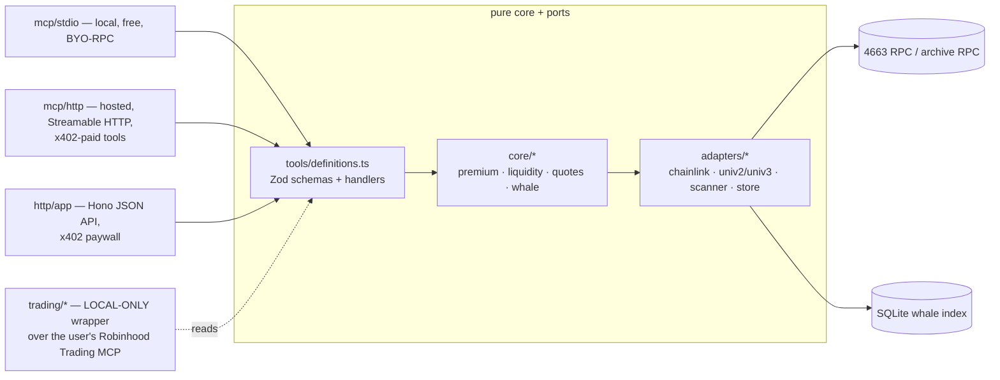

# rob-mcp — architecture

MCP server + x402-paid API exposing tokenized-equity ("stock token") data on EVM chains to AI
agents. The core is **chain-agnostic** (D-8); **Robinhood Chain (4663) is the first and default
chain**. This document is the design authority for the system shape (spec-authority rule: docs win
over code). Tool contract + pricing: `tools.md`. Decisions and open items: `design-decisions.md`.

## One core, two surfaces

- **`src/tools/definitions.ts` is the single source of truth**: tool name, Zod input/output
  schema, handler, tier. The MCP server (`registerTool`) and the Hono routes are both generated
  from it. A surface-local schema is drift and a bug.
- **Pure core first** (keeper discipline, inherited from the robbed repo's `apps/keeper`): math and
  classification are pure functions in `src/core/`, provable with `bun test` against scripted
  fakes + an injected clock (`test/fakes.ts`). Adapters implement ports; handlers receive a `Deps`
  DI container (`src/deps.ts`) so every route/tool is testable with fakes.
- **Entry points** (`src/cli.ts`): default → local stdio MCP; `serve` → hosted HTTP (Hono API +
  Streamable HTTP MCP + health + scanner head-follow); `scan` → whale backfill; `trade` → local
  trading wrapper (Phase F).

## Chain-agnostic core (D-8)

Nothing chain-specific lives in `src/core/` or `src/tools/` — chain identity is data + adapters:

- **Chain registry** (`data/chains.json`, Zod-validated): one entry per supported chain — viem
  chain definition inputs (id, name, native currency, explorer), venue addresses (Uniswap
  v2/v3 factory/quoter per chain), oracle config (Chainlink aggregator style, sequencer-uptime
  feed address if the chain is an L2), and the chain's **issuer profile** (below). Adding a chain
  is a data + registry change plus at most a new adapter, never a core change.
- **Issuer profiles** (`src/registry/issuer-profiles.ts`): tokenized equities differ per issuer —
  Robinhood Stock Tokens are ERC-20 + ERC-8056 (`uiMultiplier()`, feed includes the multiplier);
  other issuers (e.g. Backed xStocks, Dinari dShares on other EVM chains) have their own
  extension/mint semantics. A profile encodes: optional multiplier semantics, mint/redeem
  classification rules (zero-address + issuer/AP address sets), and feed-comparability rules. The
  pure core consumes profile output, never issuer specifics.
- **Scope: EVM only** — the whole stack is viem; non-EVM chains (e.g. Solana xStocks) are out of
  scope for this codebase.
- **Multi-chain runtime**: `ENABLED_CHAINS` (comma-separated ids) selects active chains; serve
  mode builds one client + scanner per enabled chain. v1 ships with `4663` alone enabled; the
  default chain for tools that omit `chain` is the first enabled chain.

## Chain layer

- One viem `PublicClient` per enabled chain, built from the chain registry (`defineChain`),
  HTTP/WS transport switch, multicall batching on by default (Robinhood's ~100ms blocks make
  batching matter).
- Config fails closed: Zod-parsed env (`loadConfig(env)`), startup aborts on missing/invalid vars;
  every enabled chain's RPC (`RPC_URL_<chainId>`) is asserted against live `eth_chainId` at boot.
- Minimal inline ABIs (`src/chain/abi.ts`): ERC-20 + optional issuer extensions (ERC-8056
  `uiMultiplier`, `balanceOfUI`), `AggregatorV3Interface`, Uniswap v3 factory/pool/QuoterV2,
  Uniswap v2 factory/pair.

## Token registry

No public on-chain stock-token registry exists on Robinhood (open item O-2) → curated per-chain
token files `data/tokens/<chainId>.json` (address, ticker, name, issuer profile, Chainlink feed if
any, known pools/venues), drafted by `scripts/seed-tokens.ts` (per-chain sources; for 4663 the
Robinhood docs token page + Chainlink address page) and gated by `scripts/verify-tokens.ts`
(on-chain symbol/decimals/profile fields + feed sanity, across all enabled chains). Nothing enters
a registry unverified (`/verify-tokens` skill).

## Data flows

All tools take an optional `chain` (chain id) input, defaulting to the first enabled chain
(Robinhood 4663 in v1); every output carries `chainId` in its provenance.

- **Premium/discount** (`stock_premium`): DEX price (best pool for the pair) vs the chain's
  Chainlink tokenized-equity feed. On 4663 the feed is 8-dec USD, updates 24/5, and **already
  includes the token's `uiMultiplier`** — never re-apply it (feed-comparability comes from the
  issuer profile). Every read gates on feed staleness AND, on L2s, the sequencer-uptime feed;
  output carries provenance (`oracleSource`, `oracleUpdatedAt`, pool, `chainId`). Tickers without
  a feed fall back to an off-chain quote port (provider: open item O-6; stub in Phase C).
- **Liquidity/spread** (`stock_liquidity`, `stock_quote`): Uniswap v3 depth from tick data
  (documented approximation acceptable for v1), spread via QuoterV2 buy/sell round-trip of a
  canonical clip; v2 from pair reserves. Venue adapters are pluggable behind
  `adapters/dex-registry.ts`; ONLY on-chain-verified venues get adapters (open item O-1 —
  Arcus/Pleiades/Rialto/Lighter unverified as of 2026-07-28).
- **Whale/mint-redeem** (`whale_activity`): chunked `eth_getLogs` Transfer scans (registry
  address list) against the archive RPC, adaptive range splitting on provider limits, persistent
  resume cursor, reorg tail re-scan; head-follow poll loop per enabled chain in serve mode with
  graceful shutdown. Classification is pure and issuer-profile-driven: `from == 0x0` → mint,
  `to == 0x0` → redeem, the profile's issuer/AP address set → AP flow, else whale when
  `amountUsd ≥ WHALE_MIN_USD` (priced via the oracle adapter).

## Storage

SQLite via `bun:sqlite` (WAL, single writer = the scanner) behind a `WhaleStore` port — Postgres
must remain a swap, not a rewrite (D-4). Schema is chain-keyed:
`events(chainId, token, block, logIndex, kind, from, to, amount, amountUsd, txHash, PRIMARY KEY(chainId, txHash, logIndex))`
plus `cursor(chainId, token, lastBlock)`. The `bun:sqlite` import is guarded so stdio mode runs on
plain Node (`npx rob-mcp`).

## Payments (x402)

API assumptions as of **2026-07-28** — re-verify via context7 before implementing
(versions-pinned rule): `@x402/hono` 2.20.0 (`paymentMiddleware`, `x402ResourceServer`),
`@x402/core` (`HTTPFacilitatorClient`), `@x402/evm` (`ExactEvmScheme`), `@x402/mcp`
(`createPaymentWrapper`, `buildPaymentRequirements`), `@coinbase/x402` 2.1.0 (CDP facilitator
auth). MCP SDK pinned to 1.30.x because `@x402/mcp` requires v1 (D-2).

Flow: request without payment → **HTTP 402** + `accepts` (scheme `exact`, CAIP-2 network, price
from the `PRICING` map, `payTo = X402_PAY_TO`) → agent client signs an EIP-3009
`transferWithAuthorization` (gasless for the payer) → retry with `X-PAYMENT` header → middleware
verifies via the facilitator → handler runs → facilitator settles USDC on Base → response carries
`X-PAYMENT-RESPONSE`. Testnet: `https://facilitator.x402.org` on `eip155:84532`; mainnet: CDP
facilitator on `eip155:8453`. The Bazaar discovery listing is enabled so tools are indexed.

**Free tier**: `/healthz` + `list_stock_tokens` are never paywalled; paid routes allow
`FREE_CALLS_PER_DAY` per IP via a sliding-window rate limiter (pluggable store; pattern from the
robbed repo's `apps/api/src/mw/ratelimit.ts`) that runs BEFORE the payment middleware (D-7).

**Hosted MCP transport**: `StreamableHTTPServerTransport`, stateless
(`sessionIdGenerator: undefined`), bridged into Hono — the bridge must be verified under Bun early
in Phase E (open item O-4); recorded fallback: sibling Node-http listener in the same process.

## Trading wrapper (local-only — the custody boundary)

`src/trading/` is a stdio MCP the user runs on their own machine (`rob-mcp trade`). It connects as
an MCP _client_ to the user's own Robinhood Trading MCP connector URL (from local config; never
stored, transmitted, or proxied server-side) and re-exposes guarded tools: `position_check`
(read-through), `order_prepare` (per-order + daily USD caps, ticker allowlist, market-hours gate,
mandatory dry-run first), `trade_execute` (only previously-prepared order ids). Distinctive guard:
refuse orders when `stock_premium` deviation exceeds a configured bound. `policy.ts` is pure and
exhaustively tested; every decision logged locally. Hosted surfaces must not import from
`src/trading/` (no-custody rule; hook-enforced). rob-security signs off on every diff here (D-6).

## Deployment

Fly.io (D-5): one shared-cpu machine + 1GB volume for SQLite, `oven/bun` slim Dockerfile,
`HEALTHCHECK` on `/healthz` (200 for ok/degraded, 503 only on genuine staleness — scanner lag,
facilitator unreachable). CI (GitHub Actions) runs `scripts/validate.sh`.

## Milestones

- **A — governance scaffold** (this doc's commit): Claude Code setup, rules, agents, skills,
  hooks, docs. Gate: user review.
- **B — scaffold + registry**: config + the chain-agnostic chain registry (`data/chains.json`,
  issuer profiles) + per-chain token registry + seed/verify scripts; stdio MCP boots with
  `list_stock_tokens`. 4663 is the only entry, but nothing may assume it is.
- **C — data core**: premium + liquidity/quotes end-to-end, free surfaces, fake-backed test suite.
- **D — whale indexer**: scanner + SQLite store + `whale_activity`; 7-day mainnet backfill sanity.
- **E — x402 + deploy**: paywall on both surfaces, Base Sepolia smoke (`/x402-smoke` skill), Fly
  deploy, Bazaar listing.
- **F — trading wrapper** (gated on a funded Robinhood Agentic Account).
- **G — polish/submissions**: hero README, npm publish, grant/hackathon writeups.
