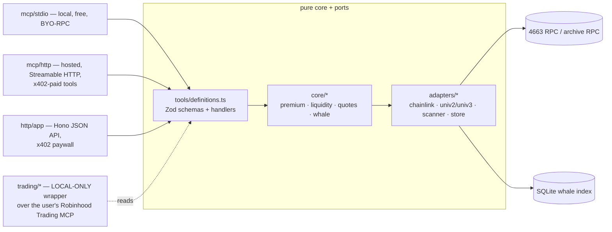

# rob-mcp — architecture

MCP server + x402-paid API exposing tokenized-equity ("stock token") data on EVM chains to AI
agents. The core is **chain-agnostic** (D-8); **Robinhood Chain (4663) is the first and default
chain**. This document is the design authority for the system shape (spec-authority rule: docs win
over code). Tool contract + pricing: `tools.md`. Public-site contract: `site.md`. Decisions and
open items: `design-decisions.md`.

## One core, two surfaces

- **`src/tools/definitions.ts` is the single source of truth**: tool name, Zod input/output
  schema, handler, tier. The MCP server (`registerTool`) and the Hono routes are both generated
  from it. A surface-local schema is drift and a bug.
- **HTTP contract (D-15)**: a tool named `<tool-name>` is exposed as
  `POST /api/v1/tools/<tool-name>` with its canonical JSON input. `GET /healthz` is the only
  non-tool health route; hosted Streamable HTTP MCP remains `POST /mcp`. No GET or unversioned
  tool aliases are generated.
- **Pure core first** (keeper discipline, inherited from the robbed repo's `apps/keeper`): math and
  classification are pure functions in `src/core/`, provable with `bun test` against scripted
  fakes + an injected clock (`test/fakes.ts`). Adapters implement ports; handlers receive a `Deps`
  DI container (`src/deps.ts`) so every route/tool is testable with fakes.
- **Entry points** (`src/cli.ts`): default → local stdio MCP; `serve` → hosted HTTP (Hono API +
  Streamable HTTP MCP + health + scanner head-follow); `scan` → whale backfill; `trade` → local
  trading wrapper (Phase F).

## Chain-agnostic core (D-8)

Nothing chain-specific lives in `src/core/` or `src/tools/` — chain identity is data + adapters:

- **Chain registry** (`data/chains.json`, Zod-validated): one entry per supported chain — viem
  chain definition inputs (id, name, native currency, explorer), venue addresses (Uniswap
  v2/v3 factory/quoter + allowed v3 fee tiers per chain), canonical quote assets and their USD
  feeds, oracle config (Chainlink aggregator style, sequencer-uptime feed address when one is
  officially available for the L2, otherwise `null`), scanner tuning, and the chain's **issuer
  profile** (below). Adding a chain is a data + registry change plus at most a new adapter, never a
  core change.
- **Issuer profiles** (`src/registry/issuer-profiles.ts`): tokenized equities differ per issuer —
  Robinhood Stock Tokens are ERC-20 + ERC-8056 (`uiMultiplier()`, feed includes the multiplier);
  other issuers (e.g. Backed xStocks, Dinari dShares on other EVM chains) have their own
  extension/mint semantics. A profile encodes: optional multiplier semantics, mint/redeem
  classification rules (zero-address + issuer/AP address sets), and feed-comparability rules. The
  pure core consumes profile output, never issuer specifics. The 4663 profile includes the
  verified ForwarderV4 proxy `0xcfAEce2151502dA2a21d47234ae1f08618A60A94` as an issuer
  participant (D-21).
- **Scope: EVM only** — the whole stack is viem; non-EVM chains (e.g. Solana xStocks) are out of
  scope for this codebase.
- **Multi-chain runtime**: `ENABLED_CHAINS` (comma-separated ids) selects active chains; serve
  mode builds one client + scanner per enabled chain. v1 ships with `4663` alone enabled; the
  default chain for tools that omit `chain` is the first enabled chain.

## Chain layer

- One viem `PublicClient` per enabled chain, built from the chain registry (`defineChain`),
  HTTP/WS transport switch, multicall batching on by default (Robinhood's ~100ms blocks make
  batching matter).
- Config fails closed: Zod-parsed env (`loadConfig(env)`), startup aborts on missing/invalid vars;
  every enabled chain's RPC (`RPC_URL_<chainId>`) is asserted against live `eth_chainId` at boot.
- Paid work is bounded by positive Zod-parsed config (D-18): `MAX_QUOTE_USD=100000`,
  `MAX_WHALE_SINCE_HOURS=168`, `MAX_WHALE_RESULTS=200`, `LIQUIDITY_CLIP_USD=10000`, and
  `ROBINHOOD_QUOTE_MAX_AGE_SECONDS=30`. These are operator safety policy, not market facts.
- Minimal inline ABIs (`src/chain/abi.ts`): ERC-20 + optional issuer extensions (ERC-8056
  `uiMultiplier`, `balanceOfUI`), `AggregatorV3Interface`, Uniswap v3 factory/pool/QuoterV2,
  Uniswap v2 factory/pair.

## Token registry

Per-chain token files `data/tokens/<chainId>.json` are deterministic, checked-in runtime snapshots
(address, ticker, name, issuer profile, Chainlink feed if any, known pools/venues). Source adapters
for `scripts/seed-tokens.ts` are chain-specific. For 4663, Robinhood's live on-chain asset registry,
the Token Contracts page generated from it, and `GET https://api.robinhood.com/rhj/assets` are the
official discovery sources (D-11); Chainlink's official Robinhood feed directory and verified
venue state enrich the draft. `scripts/verify-tokens.ts` gates every entry on live
symbol/decimals/profile fields plus feed sanity across all enabled chains. Runtime tools read the
local snapshot rather than depending on Robinhood REST availability. Nothing enters a registry
unverified (`/verify-tokens` skill).

Quote assets are also chain data (D-19). The 4663 registry starts with USDG
(`0x5fc5360D0400a0Fd4f2af552ADD042D716F1d168`, 6 decimals) and its USDG/USD Chainlink proxy
(`0x61B7e5650328764B076A108EFF5fa7282a1B9aD2`, 8 decimals), both verified on-chain on
2026-07-29. The seed script discovers token/quote pools through configured v2 factories and v3
factories/fee tiers, verifies each returned contract, and snapshots only real pools. Missing pools
remain missing; an empty `venues` list is valid registry state.

The validated chain entry therefore includes
`quoteAssets: [{ symbol, address, decimals, usdFeed: { address, decimals, heartbeatSeconds } }]`,
`venues.univ3.feeTiers: number[]`, and
`scanner: { initialChunkBlocks, reorgTailBlocks, headPollIntervalMs }`.
For 4663, USDG/USD has `heartbeatSeconds: 86400` from Robinhood's official RDD feed metadata
(verified 2026-07-29). Quote conversion rejects stale rounds against the registry value; the
adapter never supplies its own heartbeat.

## Data flows

All tools take an optional `chain` (chain id) input, defaulting to the first enabled chain
(Robinhood 4663 in v1); every output carries `chainId` in its provenance.

- **Premium/discount** (`stock_premium`): DEX price (best pool for the pair) vs the chain's
  Chainlink tokenized-equity feed. On 4663 the feed is 8-dec USD, updates 24/5, and **already
  includes the token's `uiMultiplier`** — never re-apply it (feed-comparability comes from the
  issuer profile). Every read gates on feed staleness AND, on L2s, the sequencer-uptime feed;
  output carries provenance (`oracleSource`, `oracleUpdatedAt`, pool, `chainId`). Tickers without
  a feed use the official Robinhood `/rhj/prices/{symbol}` fallback (D-12): midpoint the raw
  underlying bid/ask with decimal arithmetic, then apply `/rhj/assets.currentMultiplier`; fail
  closed on incomplete/stale data and carry provider, source-time, and multiplier provenance.
  `ROBINHOOD_QUOTE_MAX_AGE_SECONDS` is the application freshness bound, deliberately separate from
  the endpoint's cache duration. The fallback does not bypass the L2-liveness gate.
- **Robinhood sequencer availability (D-13)**: as of 2026-07-29, no official Chainlink
  sequencer-uptime feed exists for chain 4663 in
  `https://docs.chain.link/data-feeds/l2-sequencer-feeds`. The registry records `null`; registry
  discovery and `list_stock_tokens` remain available, but live price-bearing operations return
  `SEQUENCER_STATUS_UNAVAILABLE` until an official address is published and verified (O-8).
- **Oracle pause gate (D-20)**: `oraclePaused` is internal and fail-closed. An explicit upstream
  halt/pause, stale/invalid price, or unavailable required source returns a typed error rather than
  a number. Successful price-bearing outputs expose `oraclePaused: false` and
  `sequencerOk: true`; callers cannot set either gate.
- **Liquidity/spread** (`stock_liquidity`, `stock_quote`): Uniswap v3 depth from tick data
  (documented approximation acceptable for v1), spread via QuoterV2 buy/sell round-trip of a
  `LIQUIDITY_CLIP_USD` probe; v2 from pair reserves. `stock_quote.amountUsd` is positive and at
  most `MAX_QUOTE_USD`. Venue adapters are pluggable behind
  `adapters/dex-registry.ts`; ONLY on-chain-verified venues get adapters (open item O-1 —
  Arcus/Pleiades/Rialto/Lighter unverified as of 2026-07-28). When a token has no verified pool,
  `stock_liquidity` returns an empty `venues` array; quote/premium operations fail with
  `NO_VERIFIED_POOL`.
- **Whale/mint-redeem** (`whale_activity`): chunked `eth_getLogs` Transfer scans (registry
  address list) against the archive RPC, adaptive range splitting on provider limits, persistent
  resume cursor, reorg tail re-scan; head-follow poll loop per enabled chain in serve mode with
  graceful shutdown. Classification is pure and issuer-profile-driven: `from == 0x0` → mint,
  `to == 0x0` → redeem, the profile's issuer/AP address set → AP flow, else whale when
  `amountUsd ≥ WHALE_MIN_USD` (priced via the oracle adapter). Stored/output kinds and filters are
  exactly `transfer | mint | redeem | ap-flow | whale`. A query is capped by
  `MAX_WHALE_SINCE_HOURS` and `MAX_WHALE_RESULTS`. Scanner tuning is per-chain registry data; 4663
  starts at 5,000 blocks, re-scans a 200-block tail, and polls every 1,000 ms (D-18). Zero-address
  checks precede participant checks, so an initial `0x0 → participant` issuance remains `mint`.

## Storage

SQLite via `bun:sqlite` (WAL, single writer = the scanner) behind a `WhaleStore` port — Postgres
must remain a swap, not a rewrite (D-4). Schema is chain-keyed:
`events(chainId, token, block, blockTimestamp, logIndex, kind, from, to, amount, amountUsd, txHash, oracleSource, oracleUpdatedAt, oracleAddress, oracleProvider, PRIMARY KEY(chainId, txHash, logIndex))`
plus `cursor(chainId, token, lastBlock)`. `blockTimestamp` is persisted at ingestion so
`sinceHours` and result `time` do not cause per-row RPC calls; every stored `amountUsd` carries its
event-time oracle provenance. The `bun:sqlite` import is guarded so stdio mode runs on plain Node
(`npx rob-mcp`).

## Payments (x402)

API assumptions as of **2026-07-29** — re-verify via context7 before implementing
(versions-pinned rule): `@x402/hono` 2.20.0 (`paymentMiddleware`, `x402ResourceServer`),
`@x402/core` (`HTTPFacilitatorClient`), `@x402/evm` (`ExactEvmScheme`), `@x402/mcp`
(`createPaymentWrapper`, `buildPaymentRequirements`), `@coinbase/x402` 2.1.0 (CDP facilitator
auth). MCP SDK pinned to 1.30.x because `@x402/mcp` requires v1 (D-2). The facilitator endpoint
and HTTP headers below were re-verified against Coinbase's official
[x402 quickstart](https://docs.cdp.coinbase.com/x402/quickstart-for-buyers) and
[v1 → v2 migration guide](https://docs.cdp.coinbase.com/x402/migration-guide) on 2026-07-29
(D-24).

Flow: request without payment → **HTTP 402** + `PAYMENT-REQUIRED` header carrying `accepts`
(scheme `exact`, CAIP-2 network, price from the `PRICING` map, `payTo = X402_PAY_TO`) → agent
client signs an EIP-3009 `transferWithAuthorization` (gasless for the payer) → retry with
`PAYMENT-SIGNATURE` → middleware verifies via the facilitator → handler runs → facilitator settles
USDC on Base → response carries `PAYMENT-RESPONSE`. Testnet:
`https://x402.org/facilitator` on `eip155:84532`; mainnet: CDP facilitator on `eip155:8453`.
The Bazaar discovery listing is enabled so tools are indexed.

**Free tier**: `/healthz` + `list_stock_tokens` are never paywalled; paid routes allow
`FREE_CALLS_PER_DAY` per IP via a sliding-window rate limiter (pluggable store; pattern from the
robbed repo's `apps/api/src/mw/ratelimit.ts`) that runs BEFORE the payment middleware (D-7).
Client identity follows D-22: `TRUST_PROXY=none` ignores forwarding headers; `fly` trusts only a
valid `Fly-Client-IP`. The store holds at most `FREE_TIER_MAX_IDENTITIES=10000` live 24-hour
buckets; after expired entries are purged, new identities at capacity skip the free tier.

**HTTP abuse bounds** (D-22): every hosted POST body is capped by
`MAX_REQUEST_BODY_BYTES=65536` before parse/payment dispatch (config maximum 1,048,576).
Payment fingerprints remain in a bounded replay cache
(`PAYMENT_REPLAY_MAX_ENTRIES=10000`, `PAYMENT_REPLAY_TTL_SECONDS=86400`); duplicate or
capacity-unsafe payments fail closed before tool execution.

**Hosted MCP transport** (D-16; SDK API verified 2026-07-29):
`WebStandardStreamableHTTPServerTransport`, stateless (`sessionIdGenerator: undefined`), is used
directly from Hono by passing `c.req.raw` to `handleRequest` and returning the Web `Response`.
SDK 1.30 requires a fresh stateless transport per request. No `fetch-to-node` dependency or
sibling Node listener is part of the design.

## Trading wrapper (local-only — the custody boundary)

`src/trading/` is a stdio MCP the user runs on their own machine (`rob-mcp trade`). It connects as
an MCP _client_ to the user's own Robinhood Trading MCP connector URL (from local config; never
stored, transmitted, or proxied server-side) and re-exposes guarded tools: `position_check`
(read-through), `trade_prepare` (per-order + daily USD caps, ticker allowlist, market-hours gate,
mandatory dry-run first), `trade_execute` (only previously-prepared order ids). Distinctive guard:
refuse orders when `stock_premium` deviation exceeds a configured bound. `policy.ts` is pure and
exhaustively tested; every decision logged locally. Hosted surfaces must not import from
`src/trading/` (no-custody rule; hook-enforced). rob-security signs off on every diff here (D-6).
The adapter remains gated on O-9's verification of the funded upstream connector contract.

## Deployment

Fly.io (D-5): one shared-cpu machine + 1GB volume for SQLite, `oven/bun` slim Dockerfile,
`HEALTHCHECK` on `/healthz` (200 for ok/degraded, 503 only on genuine staleness — scanner lag,
facilitator unreachable). CI (GitHub Actions) runs `scripts/validate.sh`.

The public marketing/documentation site is a derived static presentation layer, not a third
runtime surface (D-23). Astro source lives under `site/` while dependencies and scripts remain in
the one root package. GitHub Pages deploys the validated main-branch artifact; pull requests build
and check it without deploying. Tool, pricing, config, registry, and availability facts are
generated from their canonical repository sources, with drift failing CI. Fly.io continues to host
the API independently. Information architecture, SEO, examples, accessibility/performance gates,
and deployment ownership are canonical in `site.md`; production deployment awaits O-10's public
hostname.

## Milestones

- **A — governance scaffold** (this doc's commit): Claude Code setup, rules, agents, skills,
  hooks, docs. Gate: user review.
- **B — scaffold + registry**: config + the chain-agnostic chain registry (`data/chains.json`,
  issuer profiles) + per-chain token registry + seed/verify scripts; stdio MCP boots with
  `list_stock_tokens`. The 4663 snapshot is seeded from D-11's official sources; 4663 is the only
  entry, but nothing may assume it is.
- **C — data core**: premium + liquidity/quotes implemented end-to-end, free surfaces,
  fake-backed test suite. Live 4663 price-bearing calls remain fail-closed under D-13 until O-8
  resolves; implementation completeness must not be mistaken for sequencer-safety availability.
- **D — whale indexer**: scanner + SQLite store + `whale_activity`; 7-day mainnet backfill sanity.
- **E — x402 + deploy**: paywall on both surfaces, Base Sepolia smoke (`/x402-smoke` skill), Fly
  deploy, Bazaar listing.
- **F — trading wrapper** (gated on a funded Robinhood Agentic Account).
- **G — site + polish/submissions**: derived Astro marketing/documentation site, dedicated pricing
  page, GitHub Pages deployment, hero README, npm publish, and grant/hackathon writeups. Gate:
  source-drift, snippet, SEO, accessibility, and performance validation from `site.md`; production
  site deployment also requires O-10.
